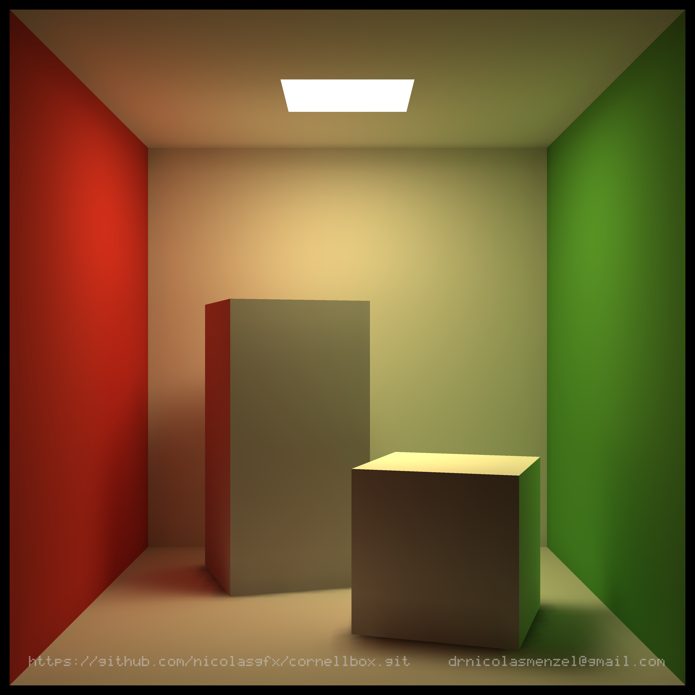

# Radiosity Cornell Box

Classic global illumination via progressive radiosity (shooting method) with
GPU-accelerated form-factor computation using NVIDIA OptiX ray tracing.



## Historical Background

In 1984, Cindy Goral and colleagues at Cornell published the first radiosity paper in computer graphics: *"Modeling the interaction of light between diffuse surfaces"* (SIGGRAPH '84). They adapted heat-transfer methods from thermal engineering to simulate light transport between surfaces. **The Cornell Box was invented specifically to validate this approach.**

Radiosity predates Monte Carlo path tracing. It's deterministic, physically-based, and produces smooth indirect lighting without noise. This implementation follows the classical patch-to-patch progressive refinement method — no approximations, no shortcuts.

## Mathematical Approach

The core equation is the **radiosity integral**:

$$B_i = E_i + \rho_i \sum_{j} B_j F_{ij}$$

Where:
- $B_i$ = total radiosity (emitted + reflected light) of patch $i$
- $E_i$ = emissive energy (light sources only)
- $\rho_i$ = surface reflectance (albedo)
- $F_{ij}$ = **form factor** (fraction of light leaving $j$ that reaches $i$)

**Form factors** are computed via the double-area integral:

$$F_{ij} = \frac{1}{A_i} \int_{A_i} \int_{A_j} \frac{\cos\theta_i \cos\theta_j \cdot V(x_i, x_j)}{\pi |x_i - x_j|^2} \, dA_j \, dA_i$$

We solve this with **Monte Carlo integration on GPU** (OptiX ray tracing for visibility $V(x_i, x_j)$), then iterate the radiosity equation until convergence (typically 50,000–100,000 iterations).

## What Makes This Special

- **Classical brute-force radiosity** — every surface exchanges light with every other surface
- **No faking** — real form factors, real visibility, real physics
- **GPU-accelerated** — OptiX ray tracing for Monte Carlo visibility sampling
- **Two-stage rendering**:
  1. Radiosity solve (CPU iterations with GPU form factors)
  2. Ray-traced final render (OptiX)
- **Smooth indirect lighting** emerges naturally from the math, no noise or denoising
- **Built from scratch** — no game engine, no middleware, just C++/CUDA/OptiX

## Workflow

```
┌─────────────┐
│ Scene Setup │  Cornell Box geometry + materials
└──────┬──────┘
       ▼
┌─────────────┐
│  Subdivide  │  Adaptive mesh → 13,000+ triangles
└──────┬──────┘
       ▼
┌─────────────┐
│Form Factors │  Monte Carlo double-area integral
│ (GPU/OptiX) │  Cosine-weighted hemisphere sampling
└──────┬──────┘
       ▼
┌─────────────┐
│ Visibility  │  Ray-traced shadows via RTX cores
│(OptiX rays) │  V(xi, xj) in form factor kernel
└──────┬──────┘
       ▼
┌─────────────┐
│ Radiosity   │  Progressive refinement (shooting)
│   Solve     │  Iterate until convergence < 0.001
└──────┬──────┘
       ▼
┌─────────────┐
│ Tone Map +  │  Exposure + gamma correction
│   Render    │  OptiX ray tracer → 3840×3840 PNG
└─────────────┘
```

## Features

- Procedural Cornell Box scene with adaptive mesh subdivision
- Progressive radiosity solver with convergence control
- GPU form factors via OptiX Monte Carlo area-to-area integration
- CPU fallback (centroid-to-centroid, no visibility)
- Smooth per-vertex color OBJ export
- OptiX ray-traced PNG output with barycentric color interpolation

## Prerequisites

- **CMake** ≥ 3.21
- **Visual Studio 2022** (or another C++17 / CUDA-capable toolchain)
- **CUDA Toolkit** (tested with 12.x)
- **NVIDIA OptiX SDK 9.1** — install to the default path or set `OptiX_INSTALL_DIR` in CMakeLists.txt
- **OpenMP** (included with MSVC)

To build without a GPU, set `-DUSE_OPTIX=OFF` in the configure step. The solver
will fall back to CPU-only form factors.

## Build

```bash
cmake --preset release
cmake --build --preset release
```

Debug build:

```bash
cmake --preset debug
cmake --build --preset debug
```

## Run

```bash
./build/bin/Release/radiosity.exe
```

Options:

| Flag | Description |
|---|---|
| `--output PATH` | Output directory (default: `output`) |
| `--no-validate` | Skip mesh validation |
| `--help` | Show help |

Output files are written to the output directory:
- `cornell_radiosity.obj` — smoothed vertex-color OBJ
- `cornell_render.png` — ray-traced PNG, front view (OptiX only)
- `cornell_render_top.png` — ray-traced PNG, top-down view with ceiling removed (OptiX only)

## Configuration

All tuning constants live in [`src/app/Config.h`](src/app/Config.h):

| Constant | Default | Description |
|---|---|---|
| `kSubdivisionTargetArea` | 0.001 | Target triangle area for subdivision |
| `kVisibilitySamples` | 32 | Monte Carlo samples per form-factor target |
| `kIndirectBoostFactor` | 1.3 | Indirect light multiplier |
| `kToneMapExposure` | 1.4 | Exposure before gamma |
| `kToneMapGamma` | 0.8 | Gamma exponent |
| `kRenderWidth/Height` | 3840 | PNG render resolution |

## Project Structure

```
src/
  main.cpp                  Entry point, radiosity solver, tone mapping
  app/Config.h              Tuning constants and CLI parsing
  scene/CornellBox.h        Procedural Cornell Box geometry
  mesh/MeshData.h           Mesh data structures
  mesh/Subdivision.h        Adaptive triangle subdivision
  mesh/PatchBuilder.h       Per-triangle geometry and material setup
  math/Vec3.h               3D vector type
  math/MathUtils.h          Triangle area, normal, centroid
  math/HemisphereSampling.h Cosine-weighted hemisphere sampling (CUDA)
  export/OBJExporter.h      Smoothed vertex-color OBJ export
  gpu/OptiXContext.h        OptiX context, GAS build, form-factor launch
  gpu/Renderer.h            OptiX ray-traced PNG renderer
  gpu/HemisphereFormFactorKernels.cu  Form-factor visibility kernel
  gpu/RenderKernels.cu      Primary-ray render kernel
third_party/
  stb_image_write.h         PNG writer (single-header library)
```

## References

- Goral, C. M., Torrance, K. E., Greenberg, D. P., & Battaile, B. (1984). *Modeling the interaction of light between diffuse surfaces.* SIGGRAPH '84.
- Cornell Box project: https://www.graphics.cornell.edu/online/box/

## License

See repository root for license information.
